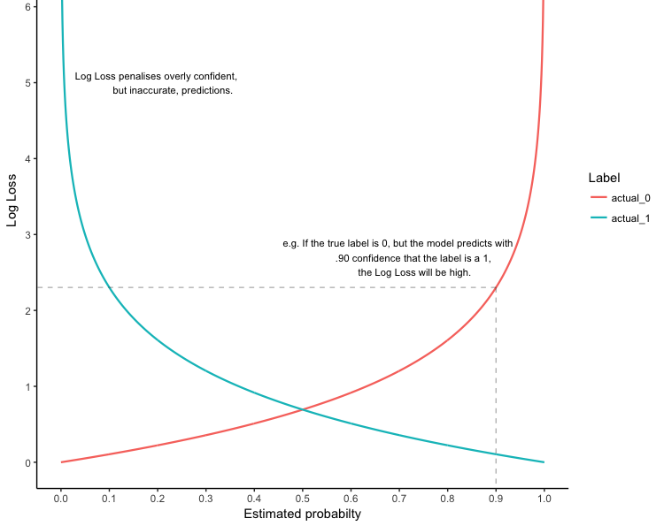

# Gradient-Boosting
Building GBM from scratch


```python
import numpy as np
import pandas as pd
from IPython.display import Image
from IPython.display import display
%config IPCompleter.greedy = True
```


```python
PATH = '/Users/Eddvibe/Developer/python/ML/pics/'
one=Image(filename = PATH + 'log_loss.png', width=500, height=500)
```


```python
pwd
```


    '/Users/Eddvibe/Developer/python/ML/boosting'


```python
import os
os.chdir('/Users/Eddvibe/Developer/python/data')
```

**GBM: theory and optimization problem statement**

Firstly, we need to specify:

 Loss function - 

 Base algorithm - 

Since we are going to do classification problem, we will use log loss and decision trees as base learners.

=-ylog(z)-(1-y)log(1-z)) 


```python
# log loss plot
display(one)
```





Gradient Boosting algorithm appeared soon after AdaBoost. Because of exponential loss function (, where  is margin) AdaBoost is too sensitive to outliers, this was the main motivation to introduce more general Boosting algorithms with arbitrary loss fucntions.

GBM uses the same heuristic as AdaBoost: we treat previous  algoritms as fixed and solve only for the 'th on each iteration, i.e. we turn one optimization problem into T sequential ones.


Thus, on iteration  we have a vector  of predictions of previous composition and we wnat to move to next approximation .

Coordinates of  can be found by solving optimization problem wrt . But GBM exploits another idea. Firstly, let's find  as a solution to the problem , e.g. using gradient descent. Then we will find  and  that approximate this solution (the vector  we found).


. 

 some initial guess


*However*, this looks very similiar to one iteration of boosting algorithm: 


So, the ***key insight*** in GBM is that if we will approximate antigradient of loss function when adding new base learner we will decrease the loss!

. Let's find  s.t.  would have been approximating  


Again, the key is that we want to add new learner to make a step as much as possible similiar to the gradient step.

***

**GBM Algorithm:**

*In*: training sample , parameter 

*Out*: base algorithms and their weights 

. Initialize: 

. for each :

. find base algorithm approximating gradient: 

. Solve 1-dimensional optimization problem: 

. Update the result of composition over the training sample: 


### Importing and preparing data


```python
ds = pd.read_csv('gbm-data.csv')
print(ds.shape)
ds.head()
```

    (3751, 1777)


<div>
<style scoped>
    .dataframe tbody tr th:only-of-type {
        vertical-align: middle;
    }

    .dataframe tbody tr th {
        vertical-align: top;
    }

    .dataframe thead th {
        text-align: right;
    }
</style>
<table border="1" class="dataframe">
  <thead>
    <tr style="text-align: right;">
      <th></th>
      <th>Activity</th>
      <th>D1</th>
      <th>D2</th>
      <th>D3</th>
      <th>D4</th>
      <th>D5</th>
      <th>D6</th>
      <th>D7</th>
      <th>D8</th>
      <th>D9</th>
      <th>...</th>
      <th>D1767</th>
      <th>D1768</th>
      <th>D1769</th>
      <th>D1770</th>
      <th>D1771</th>
      <th>D1772</th>
      <th>D1773</th>
      <th>D1774</th>
      <th>D1775</th>
      <th>D1776</th>
    </tr>
  </thead>
  <tbody>
    <tr>
      <th>0</th>
      <td>1</td>
      <td>0.000000</td>
      <td>0.497009</td>
      <td>0.10</td>
      <td>0.0</td>
      <td>0.132956</td>
      <td>0.678031</td>
      <td>0.273166</td>
      <td>0.585445</td>
      <td>0.743663</td>
      <td>...</td>
      <td>0</td>
      <td>0</td>
      <td>0</td>
      <td>0</td>
      <td>0</td>
      <td>0</td>
      <td>0</td>
      <td>0</td>
      <td>0</td>
      <td>0</td>
    </tr>
    <tr>
      <th>1</th>
      <td>1</td>
      <td>0.366667</td>
      <td>0.606291</td>
      <td>0.05</td>
      <td>0.0</td>
      <td>0.111209</td>
      <td>0.803455</td>
      <td>0.106105</td>
      <td>0.411754</td>
      <td>0.836582</td>
      <td>...</td>
      <td>1</td>
      <td>1</td>
      <td>1</td>
      <td>1</td>
      <td>0</td>
      <td>1</td>
      <td>0</td>
      <td>0</td>
      <td>1</td>
      <td>0</td>
    </tr>
    <tr>
      <th>2</th>
      <td>1</td>
      <td>0.033300</td>
      <td>0.480124</td>
      <td>0.00</td>
      <td>0.0</td>
      <td>0.209791</td>
      <td>0.610350</td>
      <td>0.356453</td>
      <td>0.517720</td>
      <td>0.679051</td>
      <td>...</td>
      <td>0</td>
      <td>0</td>
      <td>0</td>
      <td>0</td>
      <td>0</td>
      <td>0</td>
      <td>0</td>
      <td>0</td>
      <td>0</td>
      <td>0</td>
    </tr>
    <tr>
      <th>3</th>
      <td>1</td>
      <td>0.000000</td>
      <td>0.538825</td>
      <td>0.00</td>
      <td>0.5</td>
      <td>0.196344</td>
      <td>0.724230</td>
      <td>0.235606</td>
      <td>0.288764</td>
      <td>0.805110</td>
      <td>...</td>
      <td>0</td>
      <td>0</td>
      <td>0</td>
      <td>0</td>
      <td>0</td>
      <td>0</td>
      <td>0</td>
      <td>0</td>
      <td>0</td>
      <td>0</td>
    </tr>
    <tr>
      <th>4</th>
      <td>0</td>
      <td>0.100000</td>
      <td>0.517794</td>
      <td>0.00</td>
      <td>0.0</td>
      <td>0.494734</td>
      <td>0.781422</td>
      <td>0.154361</td>
      <td>0.303809</td>
      <td>0.812646</td>
      <td>...</td>
      <td>0</td>
      <td>0</td>
      <td>0</td>
      <td>0</td>
      <td>0</td>
      <td>0</td>
      <td>0</td>
      <td>0</td>
      <td>0</td>
      <td>0</td>
    </tr>
  </tbody>
</table>
<p>5 rows × 1777 columns</p>
</div>


```python
ds = ds.values
X = ds[:,1:]
y = ds[:,0]
```


```python
from sklearn.model_selection import train_test_split
```


```python
X_train, X_test, y_train, y_test = train_test_split(X, y, test_size=0.8, random_state=241)
```

### Building the model


```python
from sklearn.tree import DecisionTreeRegressor
from sklearn.tree import DecisionTreeClassifier
from sklearn.metrics import accuracy_score
```

There are **two** optimization problems in one iteration of algorithm: to find $b_t$ and $\alpha_t$

Finding base algorithm approximating gradient:

1. $b_t := \arg \min_b \sum_i^l(b(x_i) + L'(f_i, \space y_i))^2$


```python
def sigmoid(x):
    return 1/(1+np.e**(-x))
```


```python
def Log_Loss(z, y):
    ll = 0
    if y==0:
        ll = -np.log(1 - sigmoid(z))
    else:
        ll = -np.log(sigmoid(z))
    
    return ll
```


```python
# vector of pseudo-residuals, i.e. antigradient

def log_loss_grad(p, y):
    
    llg = (p-y)/(p*(1-p))
    
    return -llg
```


```python
# initialize f_i, i=1,...,l
f = np.ones(len(y_train))/2

llg = log_loss_grad(f, y_train)
```


```python
DTR = DecisionTreeRegressor(max_depth=3, random_state=241)
DTR.fit(X_train, llg)
y_pred = DTR.predict(X_train)
```

Solving optimization problem for alpha

2. $\alpha_t := \arg \min_{\alpha>0} \sum_i^l L(f_i + \alpha b_t(x_i), \space y_i)$ 


```python
# log loss as a function of alpha

def L_a(alpha):
    
    # f_i + \alpha b_t(x_i)
    f_ab = f + alpha*y_pred

    log_loss = 0

    for i, y in enumerate(y_train):
        log_loss += Log_Loss(f_ab[i], y_train[i])

    log_loss = log_loss/len(y_train)
    
    return log_loss
```

Derivative of log loss wrt $\alpha$:

$$\frac{d\big(-ylog(f_i+\alpha b_t(x_i) - (1-y)log(1-f_i-\alpha b_t (x_i))\big)}{d \alpha} = \frac{-y b_t(x_i)}{f_i+\alpha b_t(x_i)} + \frac{(1-y)b_t(x_i)}{1-f_i-\alpha b_t(x_i)}$$


```python
# gradient of L_a, (L_a is a function of alpha)

def log_loss_grad_alpha(alpha):
    f_ab = f + alpha*y_pred
    llga = 0
    for i, y in enumerate(y_train):
        llga += ((1-y)*y_pred[i])/(1-f_ab[i]) - (y*y_pred[i])/f_ab[i]
    
    return llga/len(y_train)
```


```python
def gradient_descent_alpha(lr, ep, max_iter=10000):
    
    Converged = False
    alpha = 0.01
    iter = 0
    
    # initiale gradient descent
    l_a = L_a(alpha)
    print(l_a)
    
    while not Converged:

        llga = log_loss_grad_alpha(alpha)
        #print(llga)
        alpha_new = alpha - lr * llga 
        l_a_new = L_a(alpha_new)
        print(l_a_new)
        #print('diff', l_a - l_a_new)

        if abs(l_a - l_a_new) < ep:
            print('Converged, iterations:', iter)
            Converged = True
            alpha = alpha_new
            

        iter += 1
        alpha = alpha_new
        l_a = l_a_new
        
        if iter == max_iter:
            print('Max interations exceeded')
            Converged = True
    
    return alpha
```


```python
gradient_descent_alpha(0.5, 0.05, 500)
```

    0.7133790370542159
    0.5614409570350789
    0.5298491230726964
    Converged, iterations: 1


    1.1826423070097496


```python
# Just checking that our gradient descent works properly, by plugging alphas from the set  

alphas_list = [0.001, 0.005, 0.01, 0.05, 0.1, 0.25, 0.5, 1, 1.183, 1.5, 2, 2.5, 3, 3.5, 4, 4.5]
for alpha in alphas_list:
    print(alpha, L_a(alpha))
```

    0.001 0.7164057287076877
    0.005 0.7150572860372836
    0.01 0.7133790370542159
    0.05 0.7002453946138976
    0.1 0.6845596510906762
    0.25 0.6423676127225364
    0.5 0.5879802820331357
    1 0.5339425370398806
    1.183 0.5298481850776614
    1.5 0.5385937081794466
    2 0.5833313875126095
    2.5 0.6530366410632439
    3 0.7375083215508252
    3.5 0.8305252489733037
    4 0.9284832758773301
    4.5 1.029337836169591


Updating the result of composition over the training sample:

$f_i := f_i + \alpha_t b_t(x_i), \space i=1,...,l$


```python
alpha = gradient_descent_alpha(0.5, 0.05, 500)
```

    0.7133790370542159
    0.5614409570350789
    0.5298491230726964
    Converged, iterations: 1


```python
f = f + alpha * y_pred
```


```python
f_probas = sigmoid(f)
```


```python
labels = []

for i, value in enumerate(f_probas):
    if value >= 0.5:
        labels.append(1)
    else:
        labels.append(0)

accuracy_score(y_train, labels)
```


    0.776


```python
# Let's compare our result with sklearn result

from sklearn.ensemble import GradientBoostingClassifier
```


```python
GBC = GradientBoostingClassifier(n_estimators=1, verbose=1, random_state=241)
GBC.fit(X_train, y_train)

y_pred_train = GBC.predict(X_train)

print()
print('accuracy :', accuracy_score(y_train, y_pred_train))
```

          Iter       Train Loss   Remaining Time 
             1           1.3199            0.00s
    
    accuracy : 0.776


Now let's combine these steps into one algorithm:


```python
# Despite we build our own algorithm for finding optimal alpha on each iteration, 
# it is too sensitive to learning rate and stop criteria parameters, 
# so we better use scipy.optimize

from scipy.optimize import minimize
```


```python
trees = []
alphas = []

# Intialize f, every component = 1/2
f = np.ones(len(y_train))/2

# Compute log loss gradient
llg = log_loss_grad(f, y_train)

# Run DTR to found base algorithm
DTR = DecisionTreeRegressor(max_depth=3, random_state=241)
DTR.fit(X_train, llg)
y_pred = DTR.predict(X_train) # y_pred - found b_t(x_i)
trees.append(DTR)

# Finding alpha_t
sol = minimize(L_a, x0 = 0)
alpha_t = sol.x
alphas.append(alpha_t)
print('alpha_t :', alpha_t)

# Updating composition
f = f + alpha_t * y_pred
f_probas = sigmoid(f)

# Check accuracy of new composition
labels = []
for i, value in enumerate(f_probas):
    if value >= 0.5:
        labels.append(1)
    else:
        labels.append(0)

print('iter :', 1)
print('accuracy :', accuracy_score(y_train, labels))
print()

for t in range(30):
    
    llg = log_loss_grad(f_probas, y_train)
   
    DTR = DecisionTreeRegressor(max_depth=3, random_state=241)
    DTR.fit(X_train, llg)
    y_pred = DTR.predict(X_train)
    trees.append(DTR)
    
    sol = minimize(L_a, x0 = 0)
    alpha_t = sol.x
    alphas.append(alpha_t)
    print('alpha_t :', alpha_t)
   
    f = f + alpha_t * y_pred
    f_probas = sigmoid(f)
    
    labels = []
    for i, value in enumerate(f_probas):
        if value >= 0.5:
            labels.append(1)
        else:
            labels.append(0)
    
    print('iter :', t+2)
    print('accuracy :', accuracy_score(y_train, labels))
    print()
```

    alpha_t : [1.19555012]
    iter : 1
    accuracy : 0.776
    
    alpha_t : [1.06015854]
    iter : 2
    accuracy : 0.8013333333333333
    
    alpha_t : [1.12111287]
    iter : 3
    accuracy : 0.8173333333333334
    
    alpha_t : [1.22189805]
    iter : 4
    accuracy : 0.8226666666666667
    
    alpha_t : [1.20797465]
    iter : 5
    accuracy : 0.832
    
    alpha_t : [0.60776447]
    iter : 6
    accuracy : 0.8253333333333334
    
    alpha_t : [1.21030231]
    iter : 7
    accuracy : 0.844
    
    alpha_t : [1.27305872]
    iter : 8
    accuracy : 0.8533333333333334
    
    alpha_t : [0.61842587]
    iter : 9
    accuracy : 0.852
    
    alpha_t : [2.01147598]
    iter : 10
    accuracy : 0.8573333333333333
    
    alpha_t : [1.00470717]
    iter : 11
    accuracy : 0.8653333333333333
    
    alpha_t : [1.44402366]
    iter : 12
    accuracy : 0.876
    
    alpha_t : [1.16998161]
    iter : 13
    accuracy : 0.8733333333333333
    
    alpha_t : [0.82895933]
    iter : 14
    accuracy : 0.8813333333333333
    
    alpha_t : [1.09978443]
    iter : 15
    accuracy : 0.892
    
    alpha_t : [0.89820152]
    iter : 16
    accuracy : 0.892
    
    alpha_t : [0.84253436]
    iter : 17
    accuracy : 0.8853333333333333
    
    alpha_t : [1.10775692]
    iter : 18
    accuracy : 0.8946666666666667
    
    alpha_t : [0.47115486]
    iter : 19
    accuracy : 0.8933333333333333
    
    alpha_t : [0.78297605]
    iter : 20
    accuracy : 0.8946666666666667
    
    alpha_t : [1.23516914]
    iter : 21
    accuracy : 0.904
    
    alpha_t : [0.43963784]
    iter : 22
    accuracy : 0.904
    
    alpha_t : [0.61171627]
    iter : 23
    accuracy : 0.9133333333333333
    
    alpha_t : [0.81881391]
    iter : 24
    accuracy : 0.9173333333333333
    
    alpha_t : [0.39868108]
    iter : 25
    accuracy : 0.916
    
    alpha_t : [0.71741616]
    iter : 26
    accuracy : 0.916
    
    alpha_t : [0.58132658]
    iter : 27
    accuracy : 0.9226666666666666
    
    alpha_t : [0.41127873]
    iter : 28
    accuracy : 0.924
    
    alpha_t : [0.24027635]
    iter : 29
    accuracy : 0.9213333333333333
    
    alpha_t : [0.42970226]
    iter : 30
    accuracy : 0.924
    
    alpha_t : [0.42538612]
    iter : 31
    accuracy : 0.9253333333333333
    


```python
prediction = np.ones(len(y_test))/2

for tree, alpha in zip(trees, alphas):
    y_prediction = tree.predict(X_test)
    prediction += alpha*y_prediction
    
prediction = sigmoid(prediction)

labels = []
for i, value in enumerate(prediction):
    if value >= 0.5:
        labels.append(1)
    else:
        labels.append(0)                                             

print('accuracy test, our model:', accuracy_score(y_test, labels))
```

    accuracy test, our model: 0.720759746751083


Again, let's compare our result with sklearn library


```python
GBC = GradientBoostingClassifier(n_estimators=30, learning_rate=0.2, verbose=1, random_state=241)
GBC.fit(X_train, y_train)

y_pred_train = GBC.predict(X_train)

print()
print('accuracy train:', accuracy_score(y_train, y_pred_train))
```

          Iter       Train Loss   Remaining Time 
             1           1.2613            1.70s
             2           1.1715            1.65s
             3           1.1009            1.59s
             4           1.0529            1.58s
             5           1.0130            1.52s
             6           0.9740            1.45s
             7           0.9475            1.37s
             8           0.9197            1.32s
             9           0.8979            1.24s
            10           0.8730            1.18s
            20           0.7207            0.63s
            30           0.6055            0.00s
    
    accuracy train: 0.9106666666666666


```python
y_pred_test = GBC.predict(X_test)
print('accuracy test:', accuracy_score(y_test, y_pred_test))
```

    accuracy test: 0.7477507497500833

